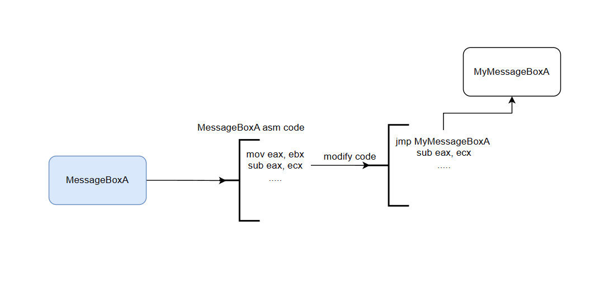
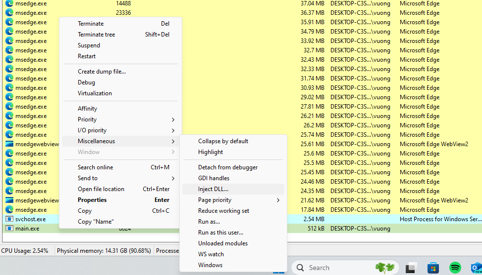
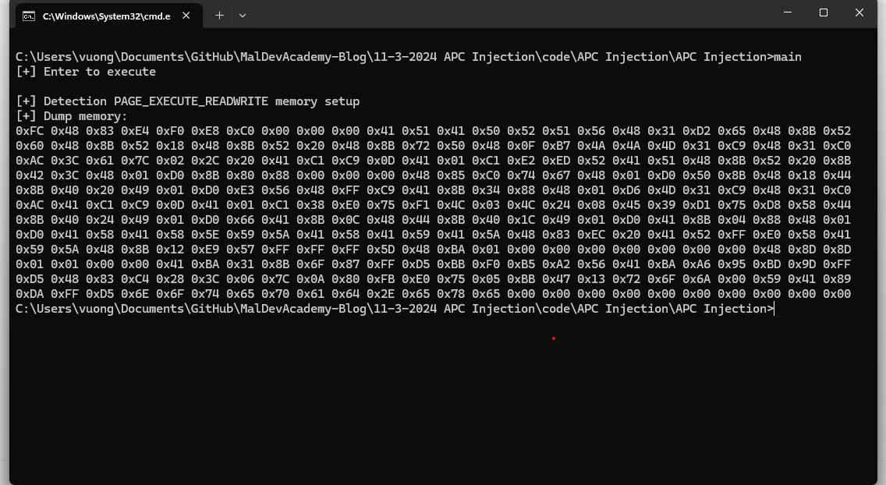

## API Hooking

API Hooking là việc chuyển hướng API gốc đến một function khác để thực thi. Điều này đạt được bằng cách đọc và sửa đổi mã của API, chuyển hướng nó đến mã cần thực thi và sửa lại ban đầu. API Hooking thường được sử dụng trong việc phân tích và gỡ lỗi, phát hiện phầm mềm độc hại, tuy nhiên trong việc phát triển malware nó cũng có 1 số chức năng như sau:

- Thu thập thông tin nhạy cảm (ví dụ: Credentials)
- Sửa đổi hoặc chặn các lệnh gọi hàm nhằm mục đích xấu
- Bỏ qua các biện pháp bảo mật bằng cách thay đổi cách hoạt động của hệ điều hành (AMSI, ETW,...)

### Cơ chế hoạt động

Dưới đây là sơ đồ cách thay đổi hành vi của 1 API:


Sau khi thực hiện sửa đổi mã của API, thực thi mã của riêng chúng ta, cần sửa lại mã như ban đầu, đồng thời có thể gọi API ở trong hàm độc hại, nhằm mục đích thực hiện API ban đầu được gọi, tránh gây chú ý.
Ngoài ra, tham số của hàm tự tạo của chúng ta cũng cần phải giống với API được gọi, nhằm truyền nó vào đợt gọi API kết tiếp.

Code đơn giản nên mình không giải thích trong bài viết, xem thêm ở mã nguồn được đính kèm.


### CheckAV

- Bản build bằng vs2022 bị phát hiện mã độc khi chưa thực thi.
- Bản build gcc không bị bắt khi chạy

### Build DLL Detection VirtualProtect Code Malicious

Như đã nói ở trước, API Hooking thường được sử dụng trong việc phát hiện mã độc hại, mã dưới đây tiếp tục phát triển mã ở trên, nhằm phát hiện phần memory độc hại được gọi với `VirtualProtectEx` trong phần `APC Injection` đã sử dụng.

```c
BOOL MyVirtualProtectEx(
    HANDLE hProcess,
    LPVOID lpAddress,
    SIZE_T dwSize,
    DWORD  flNewProtect,
    PDWORD lpflOldProtect
) {
    if (flNewProtect == PAGE_EXECUTE_READWRITE) {
        printf("[+] Detection VirtualProtectEx with PAGE_EXECUTE_READWRITE\n");
        printf("[+] Dump memory:\n");
        BYTE* bBuffer = new BYTE(dwSize);
        if (!ReadProcessMemory(hProcess, lpAddress, bBuffer, dwSize, NULL)) {
            printf("[!] ReadProcessMemory Error with code: %d\n", GetLastError());
            goto end;
        }
        for (int i = 0; i < dwSize; i++) {
            printf("0x%02X ", bBuffer[i]);
        }
        Free(bBuffer);
    }
    end:
    RemoveHook(&Hook);
    return VirtualProtectEx(
        hProcess,
        lpAddress,
        dwSize,
        flNewProtect,
        lpflOldProtect
    );
}

```
***DLL Main***
```c
BOOL APIENTRY DllMain( HMODULE hModule,
                       DWORD  ul_reason_for_call,
                       LPVOID lpReserved
                     )
{
    switch (ul_reason_for_call)
    {
    case DLL_PROCESS_ATTACH: { 
        
        if (!InititalizeHookStruct((PVOID)VirtualProtectEx, (PVOID)MyVirtualProtectEx, &Hook)) {
            printf("[!] InititalizeHookStruct Failed\n");
            break;
        }
        if (!InstallHook(&Hook)) {
            printf("[!] InstallHook Failed\n");
            break;
        }
        break;
    }
       
    case DLL_THREAD_ATTACH:
    case DLL_THREAD_DETACH:
    case DLL_PROCESS_DETACH:
        break;
    }
    return TRUE;
}


```
Sử dụng `Process Hacker` để inject DLL trên vào `APC Injection`:



Và đây là kết quả:



Vậy trong việc detection malware chúng ta có thể sử dụng hook để kiểm tra những API đáng nghi xem hành vi của chúng từ đó ngăn chặn.