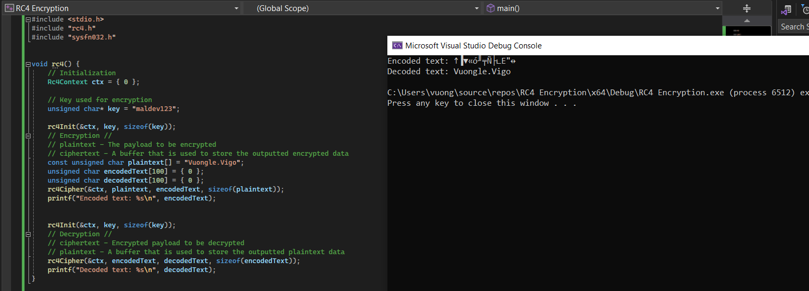

## Payload Encryption

### RC4
RC4 là một thuật toán mã hóa đối xử với dữ liệu theo các phương pháp stream cipher (mã dòng luồng). Được tạo ra bởi Ron Rivest vào năm 1987, RC4 là một thuật toán đối xử với dữ liệu byte theo từng byte, và được sử dụng rộng rãi trong các ứng dụng bảo mật, chẳng hạn như mạng không dây và SSL/TLS cho giao thức HTTPS.

Cơ chế hoạt động của RC4 đơn giản, sử dụng một khoá (key) để tạo ra một bảng S (state table) có 256 byte. Khi mã hóa, RC4 tạo ra một dãy byte ngẫu nhiên từ bảng S, và dùng nó để XOR (phép toán XOR logic) với dữ liệu cần mã hóa.

Phần này không giải thích cách mà mã hóa RC4 hoạt động, tất cả đều được triển khai trong code được update kèm theo mã. Trong đó có triển khai 2 phương pháp, 1 là tự triển khai mã (dựa theo code của MalDevAcademy gợi ý), 1 là sử dụng 2 NTAPI là *SystemFunc032* và *SystemFunc033*, trong đó 2 hàm này nhận tham số giống như nhau, nên mình chỉ triển khai 
*SystemFunc032* trong code, để sử dụng chỉ cần *GetProcAddress* của *SystemFunc033*.

Dưới đây là kết quả mã hóa khi sử dụng code tự triển khai:

Còn đây là kết quả khi sử dụng *Systemfunc032* hoặc *Systemfunc033*:

Có vẻ như kết quả mã hóa bằng *Systemfunc032* được thêm 1 phần đệm vào.

Mã hóa sẽ được sử dụng để mã hóa payload ở các phần sau, code được push kèm bài viết.

### AES CBC - WinAPI
AES là một thuật toán mã hóa đối xử, và nó hoạt động trên các khối dữ liệu cố định. Kích thước của mỗi khối là 128 bit (16 bytes). Vì vậy, dữ liệu đầu vào phải là bội số của 16 bytes. Nếu dữ liệu không phải là bội số, cần phải thêm padding cho dữ liệu mã hóa. AES hỗ trợ ba kích thước khóa chính: 128-bit, 192-bit và 256-bit. Các biến thể này được gọi lần lượt là AES-128, AES-192 và AES-256.

Phần này sử dụng WinAPI để triển khai mã hóa, API được triển 

