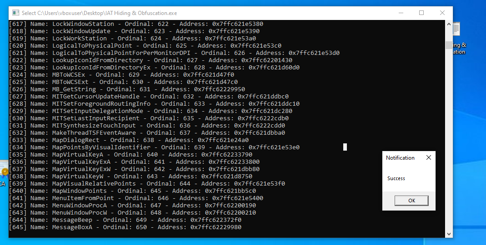

## IAT Hiding & Obfuscation - Custom GetModuleHandle

### Table of Content
1. [Giới thiệu](#giới-thiệu)
2. [PEB - Process Environment Block](#peb-1)
3. [Truy cập PEB](#peb-2)
4. [Tự viết hàm GetModuleHandle](#custom-getmodule)
5. [Lưu ý](#lưu-ý)
6. [Check AV](#check-av)


### Giới thiệu <a name = "giới-thiệu"></a>

Phần trước đã nói về cách custom `GetProcAddress` API, tuy nhiên tham số yêu cầu cần phải có HMODULE của dll đó, việc này yêu cầu ta cần sử dụng thêm hàm `GetModuleHandle`.
Hàm này chỉ có thể lấy được dll đã được tải sẵn trong chương trình, nếu chưa thì sẽ phải dùng đến `LoadLibrary` để có thể lấy được module handle. Phần này giả sử dll đã được 
tải và sẽ custom hàm `GetModuleHandle`.

### PEB - Process Environment Block <a name = "peb-1"></a>
PEB lưu trữ thông tin về process, được thông tin chi tiết tại [PEB](https://learn.microsoft.com/en-us/windows/win32/api/winternl/ns-winternl-peb), có cấu trúc như sau:
```c
typedef struct _PEB {
  BYTE                          Reserved1[2];
  BYTE                          BeingDebugged;
  BYTE                          Reserved2[1];
  PVOID                         Reserved3[2];
  PPEB_LDR_DATA                 Ldr;
  PRTL_USER_PROCESS_PARAMETERS  ProcessParameters;
  PVOID                         Reserved4[3];
  PVOID                         AtlThunkSListPtr;
  PVOID                         Reserved5;
  ULONG                         Reserved6;
  PVOID                         Reserved7;
  ULONG                         Reserved8;
  ULONG                         AtlThunkSListPtr32;
  PVOID                         Reserved9[45];
  BYTE                          Reserved10[96];
  PPS_POST_PROCESS_INIT_ROUTINE PostProcessInitRoutine;
  BYTE                          Reserved11[128];
  PVOID                         Reserved12[1];
  ULONG                         SessionId;
} PEB, *PPEB;
```
Trong đó ta sẽ để ý đến trường Ldr (PPEB_LDR_DATA), trường này lưu trữ thông tin các module được tải, thông tin tại trang microsoft [PPEB_LDR_DATA](https://learn.microsoft.com/en-us/windows/win32/api/winternl/ns-winternl-peb_ldr_data).

Cấu trúc của PEB_LDR_DATA:
```c
typedef struct _PEB_LDR_DATA {
  BYTE       Reserved1[8];
  PVOID      Reserved2[3];
  LIST_ENTRY InMemoryOrderModuleList;
} PEB_LDR_DATA, *PPEB_LDR_DATA;
```
Trong đó LIST_ENTRY là dạng double linked list, trỏ đến struct LDR_DATA_TABLE_ENTRY dưới đây:
```c
typedef struct _LDR_DATA_TABLE_ENTRY {
    PVOID Reserved1[2];
    LIST_ENTRY InMemoryOrderLinks;
    PVOID Reserved2[2];
    PVOID DllBase;
    PVOID EntryPoint;
    PVOID Reserved3;
    UNICODE_STRING FullDllName;
    BYTE Reserved4[8];
    PVOID Reserved5[3];
    union {
        ULONG CheckSum;
        PVOID Reserved6;
    };
    ULONG TimeDateStamp;
} LDR_DATA_TABLE_ENTRY, *PLDR_DATA_TABLE_ENTRY;
```
Trường `FullDllName` chứa tên mà dll được tải, `DllBase` chứa địa chỉ base của dll.

### Truy cập PEB <a name = "peb-2"></a>

***Trên hệ thống 64bits***

Đọc thông tin TEB từ offset 0x30 của thanh ghi gs:
```c
PTEB pTeb = (PTEB)__readgsqword(0x30);
PPEB pPeb = (PPEB)pTeb->ProcessEnvironmentBlock;
```
Hoặc có thể truy cập trực tiếp PEB từ offset 0x60 của thanh ghi gs:
```c
PPEB pPeb2 = (PPEB)(__readgsqword(0x60));
```

***Trên hệ thống 32 bits***

Đọc thông tin TEB từ offset 0x18 của thanh ghi gs:
```c
PTEB pTeb = (PTEB)__readfsdword(0x18);
PPEB pPeb = (PPEB)pTeb->ProcessEnvironmentBlock;
```
Hoặc truy cập trực tiếp PEB từ offset 0x30 của thanh ghi gs:
```c
PPEB pPeb2 = (PPEB)(__readfsdword(0x30));
```

### Tự viết hàm GetModuleHandle <a name = "custom-getmodule"></a>
Mã dưới đây truy cập vào ldr của từng list_entry sau đó in ra tên của module được tải.
```c
#ifdef _WIN64
	PPEB pPeb = (PEB*)(__readgsqword(0x60));
#elif _WIN32 
	PPEB pPeb = (PEB*)(__readfsdword(0x30));
#endif

	LIST_ENTRY header = pPeb->Ldr->InMemoryOrderModuleList;
	PLIST_ENTRY pListEntry = header.Flink;
	PLDR_DATA_TABLE_ENTRY ldrDataTableEntry = (PLDR_DATA_TABLE_ENTRY)(pListEntry);
	while (ldrDataTableEntry->FullDllName.Buffer) {
		wprintf(L"%s\n", ldrDataTableEntry->FullDllName.Buffer);
		pListEntry = pListEntry->Flink;
		ldrDataTableEntry = (PLDR_DATA_TABLE_ENTRY)(pListEntry);
	}
```
Kết quả:


### Lưu ý <a name = "lưu-ý"></a>  

Cấu trúc `_LDR_DATA_TABLE_ENTRY` được định nghĩa khác tại [Windows Vista Kernel Structures](https://www.nirsoft.net/kernel_struct/vista/index.html), tuy nhiên chưa thấy struct này trong trường hợp nào.
Cấu trúc có dạng như sau:
```c
typedef struct _LDR_DATA_TABLE_ENTRY {
    LIST_ENTRY InLoadOrderLinks;
    LIST_ENTRY InMemoryOrderLinks;
    LIST_ENTRY InInitializationOrderLinks;
    PVOID DllBase;
    PVOID EntryPoint;
    ULONG SizeOfImage;
    UNICODE_STRING FullDllName;
    UNICODE_STRING BaseDllName;
    ULONG Flags;
    WORD LoadCount;
    WORD TlsIndex;
    union {
        LIST_ENTRY HashLinks;
        struct {
            PVOID SectionPointer;
            ULONG CheckSum;
        };
    };
    union {
        ULONG TimeDateStamp;
        PVOID LoadedImports;
    };
    PACTIVATION_CONTEXT EntryPointActivationContext;
    PVOID PatchInformation;
    LIST_ENTRY ForwarderLinks;
    LIST_ENTRY ServiceTagLinks;
    LIST_ENTRY StaticLinks;
} LDR_DATA_TABLE_ENTRY, * PLDR_DATA_TABLE_ENTRY;
```
Đối với struct này, DllBase là giá trị tại `InInitializationOrderLinks.Flink`.

### Check AV <a name = "check-av"></a>

Kiểm tra mã phần `GetModuleHandle` và `GetProcAddress` để in `MessageBoxA` thì không thấy vấn đề gì cả:
