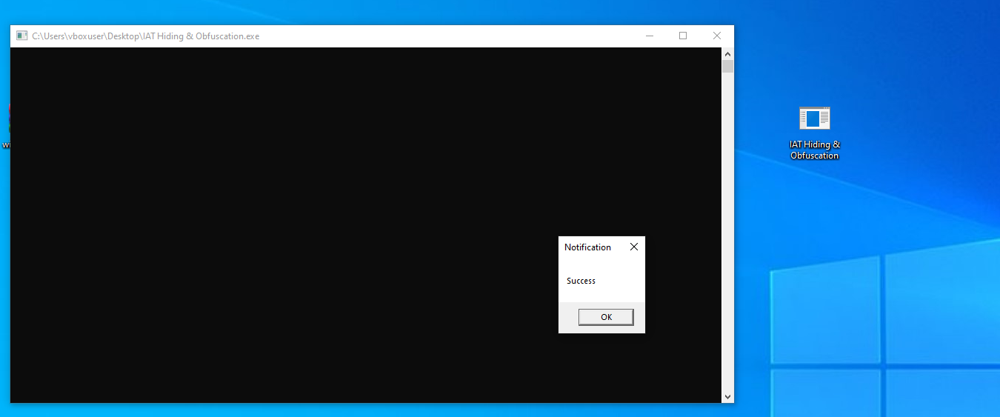

## IAT Hiding & Obfuscation - API Hashing

### Table of Content
1. [Giới thiệu](#giới-thiệu)
2. [Xây dựng hàm hash string](#build-hash)
3. [Xây dựng macro](#build-macro)
4. [Demo và check AV](#demo)

### Giới thiệu <a name = "giới-thiệu"></a>
Trong phần trước đã nói đến việc custom 2 API `GetProcAddress` và `GetModuleHandle`, tuy nhiên tham số của 2 hàm này vẫn yêu cầu sử dụng tên hàm và dll, vì vậy có thể kiểm tra string trong file để phát hiện chuỗi được sử dụng.


### Xây dựng hàm hash string <a name = "build-hash"></a>
Dưới đây là mã hàm hash string sử dụng cho cả ANSI và UNICODE, trong đó sử dụng từ khóa `constexpr` để giá trị được tính toán trong thời gian biên dịch. Sử dụng thêm hàm `RandomCompileTimeSeed` để tính `SEED` theo thời gian biên dịch.
```c
constexpr int RandomCompileTimeSeed(void)
{
	return '0' * -40271 +
		__TIME__[7] * 1 +
		__TIME__[6] * 10 +
		__TIME__[4] * 60 +
		__TIME__[3] * 600 +
		__TIME__[1] * 3600 +
		__TIME__[0] * 36000;
};

constexpr auto SEED = RandomCompileTimeSeed();
``` 

Macro `__TIME__` để lấy thời gian hiện tại trên hệ thống, sau đó lưu vào biến SEED để sử dụng. 

```c
constexpr unsigned long HashStringA(const char* str)
{
    unsigned long hash = (unsigned long)SEED;
    int c = SEED;

    while (c = *str++)
        hash = ((hash << 5) + hash) + c;
    return hash;
}

constexpr unsigned long HashStringW(const wchar_t* str)
{
    unsigned long hash = (unsigned long)SEED;
    int c = SEED;

    while (c = *str++)
        hash = ((hash << 5) + hash) + c;
    return hash;
}
```

### Xây dựng macro <a name = "build-macro"></a>
***Macro # và ##***

Macro `#` sử dụng để chuyển đổi thành chuỗi, `##` dùng để nối 2 phần tử thành 1 chuỗi.
```c
#define TOKENIZE(x) #x
#define CONCAT(X, Y) X##Y
```

***Macro hàm hash***

Sử dụng kết hợp với 2 macro chuỗi ở trên, định nghĩa các macro dưới đây với từ khóa `constexpr` để tính toán giá trị trong quá trình biên dịch, như vậy các giá trị được tính khi gọi macro sẽ hoàn được xử lý trong quá trình biên dịch.
```c
#define HASHALGOA HashStringA
#define HASHALGOW HashStringW

#define hash(VAL) constexpr auto CONCAT(hash, VAL) = HASHALGOA(TOKENIZE(VAL));
#define hashDll(DLL, VAL) constexpr auto CONCAT(hash, DLL) = HASHALGOW(VAL);

#define hashFunc(FUNCNAME, RETTYPE, ...)\
hash(FUNCNAME) typedef RETTYPE(WINAPI* CONCAT(type, FUNCNAME))(__VA_ARGS__);
```

Để sử dụng macro, ta gọi như dưới, khi đó có thể sử dụng các biến như `hashKERNEL32`, `hashMessageBoxA`:

```c
hashDll(KERNEL32, L"kernel32.dll")
hashDll(USER32, L"user32.dll")

hashFunc(MessageBoxA, HWND, LPCSTR, LPCSTR, UINT)
```

### Demo và check AV	<a name = "demo"></a>

Sau khi đã có hash, thay thế phần so sánh tên hàm và dll trong mã phần trước bằng mã so sánh hash.
```c
////////////////////////
if (HashStringA(functionName) == hashFunc) {
	return (FARPROC)functionAddress;
}
//////////////////////////
if (hashDll == HashStringW(tmp)) {
	return HMODULE(ldrDataTableEntry->Reserved2[0]);
}
```
Kiểm tra string có kết quả:

Như vậy không còn tìm thấy chuỗi `MessageBoxA` trong chương trình nữa.

Kiểm tra với AV ta cũng được kết quả tốt, mã phần này không khiến cho AV cho rằng nó độc hại.
