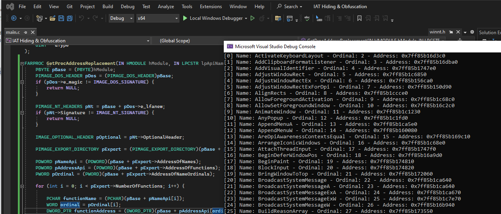

## IAT Hiding & Obfuscation - Custom GetProcAddress

### Table of Content
1. [Giới thiệu](#giới-thiệu)
2. [Hiding API bằng GetProcAddress](#hiding-api-getproc)
3. [Tự viết hàm GetProcAddress để truy suất địa chỉ hàm](#custom-getproc)
### Giới thiệu <a name = "giới-thiệu"></a>
IAT (Import Address Table) chứa thông tin về các hàm thư viện được tải động (import) vào chương trình và địa chỉ của các hàm đó trong bộ nhớ.
Việc sử dụng các API trong mã độc có thể bị phát hiện thông qua IAT nếu không thực hiện các kĩ thuật hiding và obfuscate. Với mã đơn giản `MessageBoxA`,
có thể quan sát được IAT của tệp thực thi như sau:
```c
# include <Windows.h>

int main() {
	MessageBoxA(NULL, NULL, NULL, NULL);
	return 1;
}

```


Dựa vào IAT, có thể phát hiện được các API như `GetThreadContext` và `ResumeThread`, từ đó nhận ra file có thể độc hại.

### Hiding API bằng GetProcAddress <a name = "hiding-api-getproc"></a>

`GetProcAddress` là 1 API sử dụng để lấy địa chỉ hàm dựa vào HANDLE của dll chứa hàm đó và tên hàm. Dưới đây là cách để lấy và sử dụng MessageBoxA mà không
để lại thông tin trong IAT.
```c
# include <Windows.h>

typedef int (*WINAPI MessageBoxType) (
	HWND   hWnd,
	LPCSTR lpText,
	LPCSTR lpCaption,
	UINT   uType
);

int main() {
	HMODULE hUser32 = LoadLibraryA("user32.dll");
	MessageBoxType MessageBoxAfn = (MessageBoxType)GetProcAddress(hUser32, "MessageBoxA");
	MessageBoxAfn(NULL, "Hello", "hi", MB_OK);
	return 1;
}
```


Như vậy không còn thư viện `User32.dll` và API `MessageBoxA` xuất hiện trong IAT nữa, thay vào đó sẽ có `LoadLibraryA` và `GetProcAddress` trong thư viện `Kernel32.dll`.
Tuy nhiên việc sử dụng `GetProcAddress` cũng để lại thông tin đáng nghi, vì vậy trong phần tiếp theo sẽ tìm hiểu về hàm thay thế cho `GetProcAddress`.

### Tự viết hàm GetProcAddress để truy suất địa chỉ hàm <a name = "custom-getproc"></a>
 
Hàm `GetProcAddress` sẽ tìm trong module dll địa chỉ hàm với tên hàm được truyền làm tham số, sau đó nó sẽ duyệt trong Export Directory Table để lấy địa chỉ hàm. Thông
tin chi tiết về cấu trúc được để cập tại đây: [PE format](https://learn.microsoft.com/en-us/windows/win32/debug/pe-format#export-directory-table).


***Export Directory***

Để truy cập export directory ta sử dụng mã dưới, tuy nhiên việc này yêu cầu `hModule` của dll chứa API, vì vậy nếu dll đã được tải chỉ cần sử dụng `GetModuleHandle` để
lấy handle, nếu chưa được tải sẽ cần sử dụng `LoadLibrary` để thực hiện được điều này.
```c
FARPROC GetProcAddressReplacement(IN HMODULE hModule, IN LPCSTR lpApiName) {
	PBYTE pBase = (PBYTE)hModule;
	PIMAGE_DOS_HEADER pDos = (PIMAGE_DOS_HEADER)pBase;
	if (pDos->e_magic != IMAGE_DOS_SIGNATURE) {
		return NULL;
	}

	PIMAGE_NT_HEADERS pNt = pBase + pDos->e_lfanew;
	if (pNt->Signature != IMAGE_NT_SIGNATURE) {
		return NULL;
	}

	IMAGE_OPTIONAL_HEADER pOptional = pNt->OptionalHeader;

	PIMAGE_EXPORT_DIRECTORY pExport = (PIMAGE_EXPORT_DIRECTORY)(pBase + pOptional.DataDirectory[IMAGE_DIRECTORY_ENTRY_EXPORT].VirtualAddress);

	///////////////////////////


	return NULL;
}
```

Dưới đây là struct của Export Directory:

```c
typedef struct _IMAGE_EXPORT_DIRECTORY {
    DWORD   Characteristics;
    DWORD   TimeDateStamp;
    WORD    MajorVersion;
    WORD    MinorVersion;
    DWORD   Name;
    DWORD   Base;
    DWORD   NumberOfFunctions;
    DWORD   NumberOfNames;
    DWORD   AddressOfFunctions;     // RVA from base of image
    DWORD   AddressOfNames;         // RVA from base of image
    DWORD   AddressOfNameOrdinals;  // RVA from base of image
} IMAGE_EXPORT_DIRECTORY, *PIMAGE_EXPORT_DIRECTORY;
```

Trong cấu trúc trên cần chú ý đến 3 trường quan trọng là `AddressOfFunctions`, `AddressOfNames` và `AddressOfNameOrdinals`.
Trỏ đến 3 table lần lượt là `Export Address Table`, `Export Name Pointer Table` và `Export Ordinal Table`, xem chi tiết ở
link PE format đã gửi ở trên. 3 bảng cung cấp thông tin về address, name và ordinal của API.

Phần mã để đọc các API có trong dll:

```c
PDWORD pNameApi = (PDWORD)(pBase + pExport->AddressOfNames);
PDWORD pAddressApi = (PDWORD)(pBase + pExport->AddressOfFunctions);
PWORD pOrdinal = (PWORD)(pBase + pExport->AddressOfNameOrdinals);

for (int i = 0; i < pExport->NumberOfFunctions; i++) {

	PCHAR functionName = (PCHAR)(pBase + pNameApi[i]);
	WORD ordinal = pOrdinal[i];
	DWORD_PTR functionAddress = (DWORD_PTR)(pBase + pAddressApi[ordinal]);

	printf("[%d] Name: %s - Ordinal: %d - Address: 0x%I64x\n", i, functionName, ordinal, functionAddress);
	
}
```
Đây là kết quả:



Như vậy chỉ cần truyền tham số tên API vào có thể tìm kiếm được địa chỉ có trong dll được tải.

